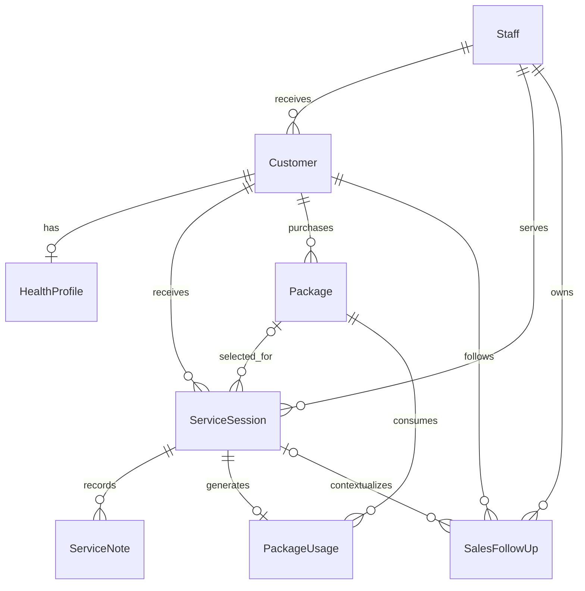

# 数据库设计

迁移入口：`supabase/migrations/202609130001_initial_schema.sql`。数据库为 Supabase PostgreSQL；数据库命名 snake_case，演示领域对象 camelCase，后续由 Repository adapter 映射。

## 实体关系

## 表与字段

| 领域模型 / 表 | 关键字段与约束 |
| --- | --- |
| Staff / staff | id、auth_user_id、name、role、active。role=admin/reception/therapist，auth_user_id对应Supabase Auth |
| Customer / customers | 姓名、唯一手机号、性别、age_years/age_range、首次到店、来源、接待人、阶段、标签数组、归档时间 |
| HealthProfile / health_profiles | customer_id为主键，保证1:1；症状、慢病、收缩压/舒张压、心率、测量时间和来源、诉求、偏好、消费观念、禁忌、备注、更新人 |
| ServiceSession / service_sessions | customer_id、service_date、staff_id、service_type、可空package_id、状态、服务前3字段、结束5字段、sales_discussed、completed_at、创建人 |
| ServiceNote / service_notes | session_id、recorded_at、客户反馈、技师观察、备注、创建人；至少一项非空 |
| Package / packages | customer_id、名称、购买日、金额numeric(12,2)、包含项目数组、总次数、有效期、状态、创建人 |
| PackageUsage / package_usages | package_id、session_id唯一、customer_id、staff_id、quantity固定1、used_at；复合外键保证客户/套餐/服务/员工一致 |
| SalesFollowUp / sales_follow_ups | customer_id、可空session_id、负责人、推荐项目/套餐、反应、顾虑数组、原话、策略、due_at、状态、实际结果、完成时间 |

## 关键约束

- 相同姓名允许多个档案，相同手机号禁止重复；健康档案以customer_id唯一。
- service_sessions(package_id, customer_id)复合外键防止扣用其他客户的套餐。
- package_usages复合外键与服务的客户、套餐、服务人员绑定；session_id唯一防重扣。
- pending跟进可以无确定日期；done必须填写实际结果和完成时间。
- 已完成服务必须有结果、客户反馈、技师总结、完成时间，完成时间不早于开始。
- 已完成服务禁止修改和删除；未完成服务通过取消保留历史。
- 当前阶段数据库写入仅供迁移/后端可信事务使用，浏览器身份只有符合RLS的读取授权。

## 套餐余额与事务

不保存可被人工修改的used_sessions/remaining_sessions字段。`package_balances`视图计算：

`已用 = SUM(package_usages.quantity)`；`剩余 = total_sessions - 已用`。

完成服务触发器锁定对应套餐行，检查所属客户、日期、状态、包含项目、余额，然后插入唯一使用流水。触发器失败会回滚服务完成写入。该行锁方案需要在部署环境继续验证跨连接并发；不能以单连接测试代替生产并发验收。

真实应用下一阶段通过单个 `complete_service` RPC 保存结束字段、可选续单/计划，由触发器消费权益。RPC应锁服务记录、检查当前状态与员工身份，并对请求id实现幂等。当前禁止直接修改已完成服务，所以相同完成更新会报错而非二次扣次；完整幂等重试接口尚未实现。

套餐购买、续期、退款与人工调整接口尚未实现。不要通过后台直接减少已消费套餐的total_sessions或修改使用流水；这些路径上线前需增加账本/审计约束。

## 查询与索引

手机号唯一索引支持精确匹配；姓名普通索引为基础结构，小门店包含搜索可用ilike，规模扩大再加pg_trgm。关键索引：客户更新时间、客户服务时间倒序、服务日期/状态、即时记录时间、套餐所属客户、套餐使用、待跟进日期/负责人、客户跟进时间。标签GIN索引用于过滤。

接待摘要由客户、健康档案、最近完成服务、余额和当前跟进聚合产生，不重复存储一份容易过期的摘要文本。生产适配器应在服务/即时记录/跟进变更后同步客户updated_at，并统一刷新相关查询。该跨表更新暂未做触发器。

## 访问边界

全部业务表启用RLS，匿名无授权。`is_active_staff()`基于auth.uid()与staff.auth_user_id匹配，拒绝未登记和停用员工。可信员工可读同一家店的业务数据；第一版未实现角色细分读权限。

staff.role不能由用户自行修改profile metadata获得。service_role key只能放可信服务端，绝不配置到NEXT_PUBLIC变量。包余额视图使用security_invoker，沿用底层RLS。

本轮不连接真实Supabase、不执行远端迁移。配置示例只预留URL和公开anon key；填好变量也不会让演示页面自动传输数据。登录、类型生成、读写适配器、角色动作权限、审计和备份验证是上线前的后续开发。

官方参考：[Supabase RLS](https://supabase.com/docs/guides/database/postgres/row-level-security)、[用户数据关联](https://supabase.com/docs/guides/auth/managing-user-data)。
